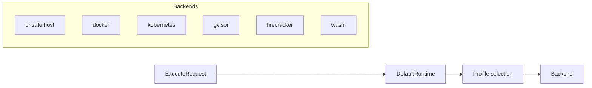
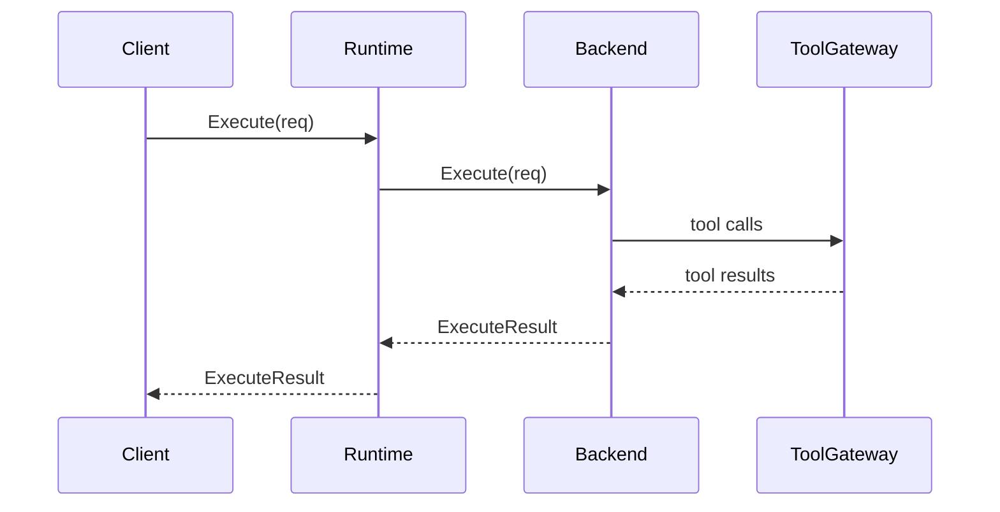

# Architecture

`toolruntime` is the execution boundary underneath `toolcode`.
It chooses a backend based on the requested security profile.

## Runtime selection

## Execution sequence

## Profiles

- `dev`: convenience, unsafe host allowed
- `standard`: safer defaults, may deny unsafe backend
- `hardened`: expected to require strong isolation
