# User Journey

This journey shows how `toolruntime` powers secure code execution in the broader stack.

## End-to-end flow (stack view)

```mermaid
%%{init: {'theme': 'base', 'themeVariables': {'primaryColor': '#e53e3e', 'primaryTextColor': '#fff'}}}%%
flowchart TB
    subgraph config["Configuration"]
        Cfg["⚙️ RuntimeConfig"]
        Profiles["🔒 Security Profiles<br/><small>Dev | Standard | Hardened</small>"]
    end

    subgraph runtime["toolruntime.Runtime"]
        Router["🔀 Backend Router"]
    end

    subgraph backends["Execution Backends"]
        Unsafe["⚠️ UnsafeHost<br/><small>dev only</small>"]
        Docker["🐳 Docker<br/><small>container isolation</small>"]
        K8s["☸️ Kubernetes<br/><small>short-lived pods</small>"]
        GVisor["🛡️ gVisor<br/><small>user-space kernel</small>"]
        Kata["🔐 Kata<br/><small>lightweight VMs</small>"]
        WASM["🌐 WASM<br/><small>in-process sandbox</small>"]
    end

    subgraph gateway["Tool Gateway"]
        TG["🚪 ToolGateway<br/><small>only allowed surface</small>"]
        Search["SearchTools()"]
        Describe["DescribeTool()"]
        RunTool["RunTool()"]
    end

    subgraph output["Output"]
        Result["📦 ExecuteResult<br/><small>+ LimitsEnforced</small>"]
    end

    Cfg --> Profiles --> Router
    Router -->|dev| Unsafe
    Router -->|standard| Docker
    Router -->|standard| K8s
    Router -->|hardened| GVisor
    Router -->|hardened| Kata
    Router -->|any| WASM

    Docker --> TG
    K8s --> TG
    GVisor --> TG
    WASM --> TG

    TG --> Search
    TG --> Describe
    TG --> RunTool
    TG --> Result

    style config fill:#718096,stroke:#4a5568
    style runtime fill:#e53e3e,stroke:#c53030,stroke-width:2px
    style backends fill:#6b46c1,stroke:#553c9a
    style gateway fill:#38a169,stroke:#276749
    style output fill:#3182ce,stroke:#2c5282
```




### Security Profiles


## Step-by-step

1. **Configure runtime** with backends keyed by security profile.
2. **Wrap tool access** using a `ToolGateway` (direct or proxy).
3. **Execute request** is routed to the backend based on profile.
4. **Backend runs code** with controlled access to tools via the gateway.
5. **Result and tool calls** are returned, with `LimitsEnforced` indicating actual enforcement.

## Example: wire runtime to toolcode

```go
rt := toolruntime.NewDefaultRuntime(toolruntime.RuntimeConfig{
  Backends: map[toolruntime.SecurityProfile]toolruntime.Backend{
    toolruntime.ProfileStandard: mySandboxBackend,
  },
  DefaultProfile: toolruntime.ProfileStandard,
})

engine, err := toolcodeengine.New(toolcodeengine.Config{
  Runtime: rt,
  Profile: toolruntime.ProfileStandard,
})
if err != nil {
  return err
}

exec, _ := toolcode.NewDefaultExecutor(toolcode.Config{
  Index: idx,
  Docs:  docs,
  Run:   runner,
  Engine: engine,
})
```

## Expected outcomes

- Clear security posture by profile.
- Consistent tool access via a gateway boundary.
- Transparent limit enforcement reporting.

## Common failure modes

- `ErrRuntimeUnavailable` if no backend is registered for the profile.
- `ErrBackendDenied` when policy blocks unsafe backends.
- `ErrTimeout` / `ErrResourceLimit` on enforced limits.
